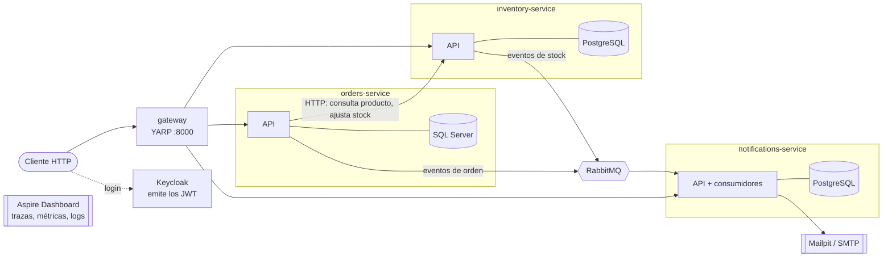

# Commerce Platform

Plataforma de comercio construida como microservicios en **.NET 10**: catálogo y stock, pedidos y notificaciones al cliente. Es un proyecto de aprendizaje/portafolio que aplica las prácticas de un entorno profesional: Clean Architecture, CQRS, mensajería con outbox, pruebas contra infraestructura real, CI por servicio y observabilidad distribuida.

## Arquitectura



| Servicio | Responsabilidad | Base de datos | Puerto (Docker) |
|---|---|---|---|
| [gateway](gateway/README.md) | Única entrada HTTP: enruta por prefijo a los servicios (YARP) | - | 8000 |
| [inventory-service](inventory-service/README.md) | Catálogo de productos, categorías, tipos y control de stock | PostgreSQL | 8080 |
| [orders-service](orders-service/README.md) | Clientes y ciclo de vida de las órdenes (crear, confirmar, enviar, entregar, cancelar) | SQL Server | 8081 |
| [notifications-service](notifications-service/README.md) | Convierte los eventos en correos (al cliente y a operaciones) | PostgreSQL | 8082 |

Cada servicio es autónomo (su propia solución, base de datos, Dockerfile y CI) y usa la misma estructura: `Domain` → `Application` (CQRS con MediatR) → `Infrastructure` → `API`.

## Cómo se comunican

- **Síncrono (HTTP)**: Orders llama a Inventory cuando necesita una respuesta inmediata (¿existe el producto? ¿hay stock?), con reintentos y circuit breaker.
- **Asíncrono (RabbitMQ + MassTransit)**: Orders e Inventory publican eventos (`OrderConfirmed`, `ProductLowStock`, ...) y Notifications los consume. Se usa un **outbox transaccional**: el evento se guarda en la misma transacción que el cambio y se entrega después, así no se pierde si el broker cae. El consumidor usa un **inbox** para descartar mensajes duplicados, y los envíos fallidos se reintentan y terminan en una cola `_error`.
- **Contratos**: los eventos se identifican por nombre completo (`Commerce.Contracts.*`); cada consumidor declara su propia copia, sin proyectos compartidos entre servicios.

## Ejecutar todo

Requisitos: .NET 10 SDK y Docker.

```bash
docker compose up --build
```

| URL | Qué es |
|---|---|
| http://localhost:8000 | Gateway: `/inventory/**`, `/orders/**`, `/notifications/**` |
| http://localhost:8180 | Keycloak (consola `admin` / `admin`; realm `commerce`) |
| http://localhost:8080/swagger | API de Inventory |
| http://localhost:8081/swagger | API de Orders |
| http://localhost:8082/swagger | API de Notifications |
| http://localhost:8025 | Mailpit: los correos que envía Notifications |
| http://localhost:15672 | Consola de RabbitMQ (`guest` / `guest`) |
| http://localhost:18888 | Aspire Dashboard: trazas, métricas y logs |

Las APIs corren en `Development`, así que aplican sus migraciones al arrancar e Inventory carga datos de ejemplo. Para trabajar en un solo servicio hay un `docker-compose.yml` dentro de cada carpeta (no los uses a la vez que el de la raíz: comparten puertos).

### Probar el flujo completo

```bash
# 1. Un producto de Inventory y un cliente en Orders
PRODUCT=$(curl -s "http://localhost:8080/api/v1/products?pageSize=1" | grep -o '"id":"[^"]*"' | head -1 | cut -d'"' -f4)
CUSTOMER=$(curl -s -X POST http://localhost:8081/api/v1/customers -H "Content-Type: application/json" \
  -d '{"name":"Maria Lopez","email":"maria@example.com"}' | grep -o '"id":"[^"]*"' | head -1 | cut -d'"' -f4)

# 2. Crear y confirmar una orden (Orders descuenta el stock en Inventory)
ORDER=$(curl -s -X POST http://localhost:8081/api/v1/orders -H "Content-Type: application/json" \
  -d "{\"customerId\":\"$CUSTOMER\",\"items\":[{\"productId\":\"$PRODUCT\",\"quantity\":1}]}" | grep -o '"id":"[^"]*"' | head -1 | cut -d'"' -f4)
curl -X POST http://localhost:8081/api/v1/orders/$ORDER/confirm

# 3. Ver el resultado: correos en http://localhost:8025 y notificaciones guardadas
curl "http://localhost:8082/api/v1/notifications?orderId=$ORDER"
```

Si el stock del producto baja de su nivel de reorden, Inventory publica `ProductLowStock` y llega una alerta al correo de operaciones.

## Observabilidad

Los tres servicios exportan por OpenTelemetry (OTLP) a un único **Aspire Dashboard**:

- **Trazas distribuidas**: una petición se sigue de punta a punta, por ejemplo `POST /orders/{id}/confirm` → consultas a SQL Server → llamada HTTP a Inventory → consultas a PostgreSQL → publicación en RabbitMQ → consumo en Notifications. Incluye las consultas de base de datos y el paso por el outbox de MassTransit.
- **Métricas**: ASP.NET Core, HTTP, runtime de .NET, Npgsql y MassTransit.
- **Logs** estructurados de Serilog enviados por OTLP, con el identificador de traza.

Fuera de Docker, los servicios exportan a `localhost:4317` (el dashboard lo publica en ese puerto).

## Pruebas

Cada servicio tiene pruebas unitarias y de integración. Las de integración usan **Testcontainers** con la infraestructura real (PostgreSQL / SQL Server, RabbitMQ y Mailpit), no dobles en memoria; Docker debe estar corriendo.

```bash
cd orders-service && dotnet test
```

## Flujo de trabajo y CI

GitHub Flow: `main` siempre desplegable y protegida (solo PR, con CI en verde). Las ramas se nombran `<servicio>/<tipo>-<descripción>` (por ejemplo `orders/feature-create-order`). Cada servicio tiene su workflow en `.github/workflows/` que solo ejecuta sus pasos cuando cambia su carpeta, pero siempre reporta el estado para que los checks requeridos no queden pendientes.

## Decisiones de diseño

- **Monorepo** con servicios autónomos: se comparte `CLAUDE.md` y las herramientas de `.claude/` entre servicios sin acoplar el código.
- **Persistencia políglota**: PostgreSQL y SQL Server a propósito; cada servicio es dueño de su base y nadie más la lee.
- **MassTransit v8** (Apache 2.0): desde la v9 tiene licencia comercial.
- **Compensación síncrona** al confirmar/cancelar órdenes (sin saga): simplificación consciente, documentada en el README de Orders.
- Las imágenes Alpine corren en globalización invariante: el código nunca pide una cultura concreta y las imágenes que usan SQL Server instalan ICU.

## Seguridad (en construcción)

El gateway enruta y **Keycloak** ya está listo con el realm `commerce` (se importa desde `keycloak/commerce-realm.json`): los usuarios `admin` / `admin` (rol `admin`) y `maria` / `maria` (rol `customer`), y el cliente `orders-service` para las llamadas entre servicios (rol `service`). Un token se pide así:

```bash
curl -s -X POST http://localhost:8180/realms/commerce/protocol/openid-connect/token \
  -d grant_type=password -d client_id=commerce-web -d username=maria -d password=maria
```

Todavía **no se exige el token**: falta que el gateway y los tres servicios validen el JWT y apliquen los roles, y que Orders use su propia cuenta de servicio para hablar con Inventory. Ese es el siguiente trabajo.
